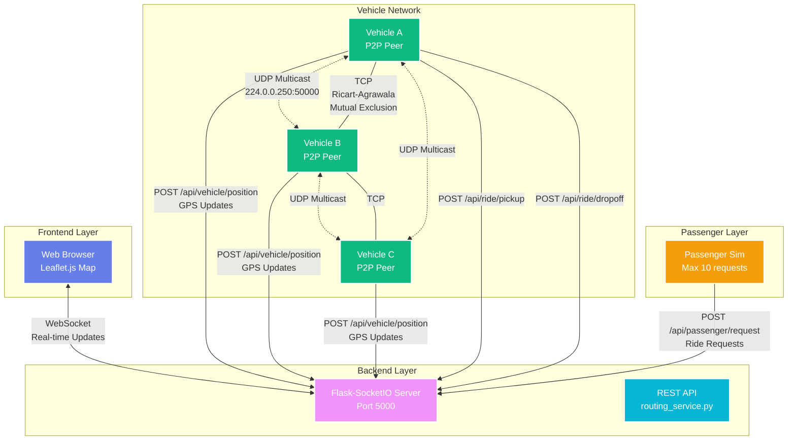

# CECS 327 – RideShare Communication Systems


## Components and Purpose

| File | Type | Purpose |
|------|------|----------|
| `aggregator_server.py` | TCP Server | Central dispatcher that listens for multiple driver updates using sockets and threads. |
| `driver_client.py` | TCP Client | Simulated driver sending GPS/location/status to the dispatcher over TCP. |
| `aggregator_server_udp.py` | UDP Listener | Receives quick “fire-and-forget” GPS updates from drivers. |
| `driver_client_udp.py` | UDP Sender | Sends low-latency GPS pings to the UDP listener. |
| `routing_service.py` | REST API | Flask web service for passengers to request rides and check ETA. |
| `demo_client.py` | REST Client | Sends test ride requests to the Flask API. |
| `publisher_driver.py` | Pub/Sub Publisher | Broadcasts driver updates to subscribers using UDP. |
| `subscriber_rider.py` | Pub/Sub Subscriber | Receives broadcast messages and prints live driver updates. |
| `p2p/p2p_node.py` | P2P Core | Asyncio peer-to-peer node with UDP multicast discovery and TCP messaging. |
| `p2p/vehicle_peer.py` | P2P Runner | Vehicle simulator that broadcasts location to nearby peers. |
| `server.py` | Flask Server | Backend for live tracking, serving frontend and handling WebSocket updates. |
| `frontend/` | Web App | Premium UI with Leaflet maps for real-time vehicle tracking. |

---

## Requirements

- Python 3.10 or higher
- Works on Windows, macOS, and Linux
- Works best on WSL/Linux (for sockets)
- Dependencies (minimal, stdlib used for P2P):
  - Flask (REST), requests (client)
  - Flask-SocketIO (Real-time), Eventlet (Async)
  - Twisted (optional legacy, not required for P2P)
  - ```cmd
    pip install flask flask-socketio eventlet requests
    ```

Install:

```cmd
py -m pip install -r requirements.txt
```

---

## How to Run Each Module

<u>TCP (Driver + Dispatcher)</u>

```cmd
py -m ipc.aggregator_server
```

In a second terminal:

```cmd
py -m ipc.driver_client
```

<u>UDP (Low-Latency Updates)</u>

```cmd
py -m ipc.aggregator_server_udp
```

In a second terminal:

```cmd
py -m ipc.driver_client_udp
```

<u>REST API (Flask)</u>

```cmd
py -m rest.routing_service
```

In a second terminal:

```cmd
py -m rest.demo_client
```

<u>Pub/Sub (Broadcast Model)</u>

```cmd
py -m pubsub.subscriber_rider
```

In a second terminal:

```cmd
py -m pubsub.publisher_driver
```

---

<u>Peer-to-Peer (P2P) Communication System</u>

- Option A (bind to all interfaces, good for LAN testing):
```cmd
py -m p2p.vehicle_peer --id veh-A --host 0.0.0.0 --port 0 --mgroup 224.0.0.250 --mport 50000
```
In another terminal:
```cmd
py -m p2p.vehicle_peer --id veh-B --host 0.0.0.0 --port 0 --mgroup 224.0.0.250 --mport 50000
```
- Option B (force loopback, safest if multicast is restricted):
```cmd
py -m p2p.vehicle_peer --id veh-A --host 127.0.0.1 --port 0 --mgroup 224.0.0.250 --mport 50000
```
And in another terminal:
```cmd
py -m p2p.vehicle_peer --id veh-B --host 127.0.0.1 --port 0 --mgroup 224.0.0.250 --mport 50000
```

Alternate runner (core demo):
```cmd
py -m p2p.p2p_node --id veh-X --host 127.0.0.1
```
---

<u>Live Tracking System (Frontend + Backend)</u>

1. Start the Flask-SocketIO Server:
```cmd
py server.py
```
2. Open Browser:
   Navigate to `http://localhost:5000`

3. Start Vehicle Peers (in separate terminals):
```cmd
py -m p2p.vehicle_peer --id veh-A --host 127.0.0.1 --port 0
```
```cmd
py -m p2p.vehicle_peer --id veh-B --host 127.0.0.1 --port 0
```

See `Live Demo/README.md` for a complete guide.

---

## System Architecture

The rideshare system uses multiple communication patterns:



### Communication Patterns

| Pattern | Files | Description |
|---------|-------|-------------|
| **TCP Sockets** | `ipc/aggregator_server.py`, `ipc/driver_client.py` | Reliable client-server communication |
| **UDP Sockets** | `ipc/aggregator_server_udp.py`, `ipc/driver_client_udp.py` | Fast, low-latency GPS updates |
| **REST API** | `rest/routing_service.py`, `rest/demo_client.py` | HTTP endpoints for ride requests |
| **Pub/Sub** | `pubsub/publisher_driver.py`, `pubsub/subscriber_rider.py` | Broadcast driver updates |
| **P2P Network** | `p2p/p2p_node.py`, `p2p/vehicle_peer.py` | Decentralized vehicle coordination |
| **WebSocket** | `server.py`, `frontend/app.js` | Real-time browser updates |

---

### Detailed Ride Management Flow

The following diagram shows the complete ride lifecycle with destination routing:

```mermaid
graph TB
    subgraph "Client Layer"
        Browser[Web Browser<br/>(Leaflet.js + Socket.IO)]
    end
    
    subgraph "Backend Services"
        Flask[Flask-SocketIO Server<br/>:5000]
        RideMgr[Ride Assignment<br/>Engine]
        PassMgr[Passenger<br/>Manager]
        VehMgr[Vehicle<br/>Tracker]
    end
    
    subgraph "Vehicle Fleet (P2P Network)"
        VehA[Vehicle A<br/>Peer Node]
        VehB[Vehicle B<br/>Peer Node]
        VehC[Vehicle C<br/>Peer Node]
    end
    
    subgraph "Passenger System"
        PassSim[Passenger Simulator<br/>(Max 10 requests)]
    end
    
    %% Real-time WebSocket
    Browser <===>|WebSocket<br/>Real-time Events| Flask
    
    %% HTTP API calls from vehicles
    VehA -->|POST /api/vehicle/position<br/>GPS Updates| VehMgr
    VehB -->|POST /api/vehicle/position| VehMgr
    VehC -->|POST /api/vehicle/position| VehMgr
    
    VehA -.->|POST /api/ride/pickup| RideMgr
    VehA -.->|POST /api/ride/dropoff| RideMgr
    
    %% Passenger requests
    PassSim -->|POST /api/passenger/request<br/>(origin + destination)| PassMgr
    
    %% Internal server flow
    VehMgr --> Flask
    PassMgr --> RideMgr
    RideMgr -->|emit events| Flask
    
    %% Events to frontend
    Flask -.->|ride_assigned| Browser
    Flask -.->|destination_routing| Browser
    Flask -.->|passenger_removed| Browser
    Flask -.->|vehicle_update| Browser
    Flask -.->|passenger_update| Browser
    
    %% P2P Communication
    VehA <-.->|UDP Multicast<br/>224.0.0.250:50000| VehB
    VehB <-.->|UDP Multicast| VehC
    VehC <-.->|UDP Multicast| VehA
    
    VehA ---|TCP<br/>Ricart-Agrawala<br/>Mutex| VehB
    VehB ---|TCP| VehC
    
    %% Styling
    style Browser fill:#667eea,stroke:#fff,stroke-width:3px,color:#fff
    style Flask fill:#f093fb,stroke:#fff,stroke-width:3px,color:#fff
    style RideMgr fill:#f5576c,stroke:#fff,stroke-width:2px,color:#fff
    style PassMgr fill:#f59e0b,stroke:#fff,stroke-width:2px,color:#fff
    style VehMgr fill:#06b6d4,stroke:#fff,stroke-width:2px,color:#fff
    style VehA fill:#10b981,stroke:#fff,stroke-width:2px,color:#fff
    style VehB fill:#10b981,stroke:#fff,stroke-width:2px,color:#fff
    style VehC fill:#10b981,stroke:#fff,stroke-width:2px,color:#fff
    style PassSim fill:#f59e0b,stroke:#fff,stroke-width:2px,color:#fff
```

**Ride Flow Explanation:**
1. **Passenger** requests a ride via `passenger_sim.py` (max 10)
2. **Ride Manager** assigns nearest available vehicle
3. **Vehicle peers** navigate to pickup → destination using P2P coordination
4. **Flask server** broadcasts all state changes via WebSocket
5. **Frontend** visualizes everything in real-time on Leaflet map


---

## Testing


Run unit tests (includes P2P discovery/messaging):

```cmd
py -m unittest -v p2p.test_p2p
```

---
